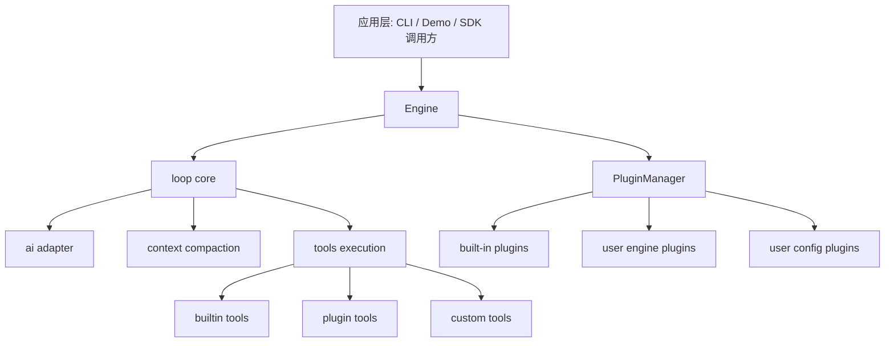

# 01｜引擎总览与设计目标

## 1. 目标与定位

`pulse-coder-engine` 是一个可扩展的 Agent Runtime，承担以下职责：
- 统一管理 AI 对话循环（Loop）
- 挂载工具（Built-in + 插件 + 业务自定义）
- 提供插件生命周期与 Hook 扩展点
- 管理上下文压缩、错误恢复、重试等运行时策略
- 对外暴露稳定 API（`Engine`）给 CLI 或其他应用层调用

从当前实现看，设计核心是：
- `Engine` 负责装配与协调
- `loop` 负责执行与状态推进
- `PluginManager` 负责扩展能力接入

## 2. 模块分层

## 3. 目录到能力映射

| 目录 | 角色 | 代表文件 |
|---|---|---|
| `Engine.ts` | 引擎入口与编排 | `Engine.ts` |
| `core/` | 运行循环 | `core/loop.ts` |
| `ai/` | LLM 调用适配 | `ai/index.ts` |
| `context/` | 上下文压缩 | `context/index.ts` |
| `tools/` | 工具注册与实现 | `tools/index.ts` + 各工具 |
| `plugin/` | 插件协议与管理器 | `EnginePlugin.ts` / `PluginManager.ts` |
| `built-in/` | 内置插件能力包 | `mcp/skills/plan-mode/sub-agent` |
| `config/` | 全局常量与环境变量 | `config/index.ts` |
| `prompt/` | System Prompt 组装 | `prompt/system.ts` |

## 4. 核心抽象（接口）

### 4.1 EngineOptions（面向调用方）

`EngineOptions` 支持：
- `enginePlugins` / `userConfigPlugins`
- `disableBuiltInPlugins`
- `llmProvider` + `model`
- `tools`（业务直注入）
- `systemPrompt`
- `hooks`（legacy ToolHooks，内部转换为新 Hook）
- `logger`

这意味着调用方可以从“零改代码”到“深度定制”平滑升级。

### 4.2 Tool（统一工具协议）

统一结构：
- `name`
- `description`
- `inputSchema`（zod/flexible schema）
- `execute(input, context?)`

所有工具都在 loop 中以同一协议调用，可被 hook 包装。

### 4.3 Plugin 与 Hook（扩展协议）

插件遵循 `EnginePlugin` 生命周期：
- `beforeInitialize`
- `initialize`
- `afterInitialize`
- `destroy`

Hook 定义在 `EngineHookMap`：
- `beforeRun` / `afterRun`
- `beforeLLMCall` / `afterLLMCall`
- `beforeToolCall` / `afterToolCall`

## 5. 全局执行视角

## 6. 当前架构优点

- 主干清晰：`Engine` + `loop` + `PluginManager` 三段职责分明。
- 扩展成本低：可以通过插件注入工具、服务、hook。
- 兼容性考虑到位：legacy `ToolHooks` 仍可工作。
- 内置插件覆盖典型能力：MCP、skills、plan-mode、sub-agent。

## 7. 当前架构边界与已知约束

- 用户配置插件“应用配置”阶段仍偏占位（主要日志输出）。
- 多个工具使用同步 I/O，可能阻塞 Node 事件循环。
- `SubAgentPlugin` 内部直接调用 `loop`，默认 provider/model 继承策略不够显式。
- 部分插件内部仍混用 `console.*` 与 `context.logger`。

## 8. 后续迭代方向（建议）

- 把运行时状态（step/error/compaction）结构化暴露为 metrics 接口。
- 将工具执行层改造成 async + timeout + cancel 统一抽象。
- 增加“策略层”：如不同模式下 tool allowlist/blocklist 的硬约束。
- 为插件系统增加健康检查与降级策略（例如插件加载失败隔离）。

---

本章结论：当前实现已经具备“生产可演进”的骨架，下一阶段重点是把可扩展骨架升级为可运维、可观测、可治理的运行时平台。