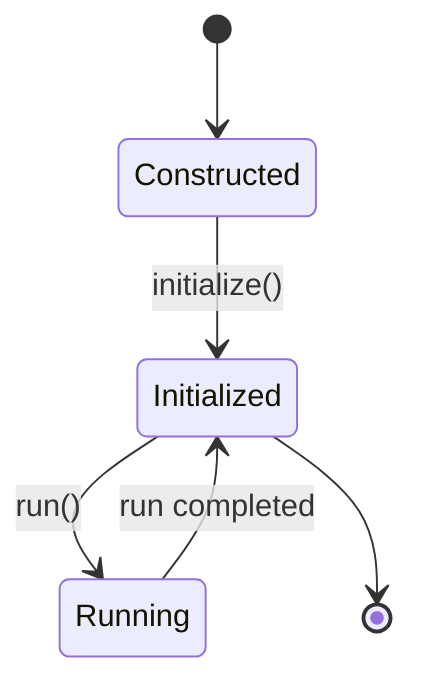
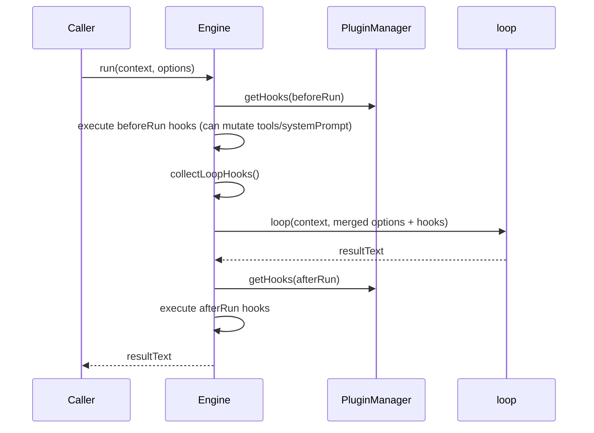

# 02｜运行时生命周期（Engine）

## 1. 生命周期总览

`Engine` 的生命周期分三段：
1. 构造：初始化内部状态与默认工具
2. 初始化：加载插件并合并工具
3. 运行：执行 `run(context, options)` 并返回最终文本

## 2. 构造阶段（constructor）

关键动作：
- 创建 `PluginManager`（可注入 logger）
- 以 `BuiltinToolsMap` 作为初始工具集合
- 保存 `options` 与 `config`

关键点：
- 这一步**不加载插件**，只做轻初始化。
- 全局 `config` 是 Engine 内部 map-like 对象（`getConfig` / `setConfig`）。

## 3. 初始化阶段（initialize）

### 3.1 prepareEnginePlugins

逻辑优先级：
- 若 `disableBuiltInPlugins = true`：只用用户插件
- 否则：`builtInPlugins + userPlugins`
- 默认扫描目录：
  - `.pulse-coder/engine-plugins`
  - `.coder/engine-plugins`
  - `~/.pulse-coder/engine-plugins`
  - `~/.coder/engine-plugins`

### 3.2 PluginManager.initialize

按顺序：
1. `loadEnginePlugins`
2. `validateCoreCapabilities`
3. `loadUserConfigPlugins`

### 3.3 工具合并

最终工具优先级（高 → 低）：
1. `EngineOptions.tools`（业务方直注入）
2. 插件注册工具
3. 内置工具 `BuiltinToolsMap`

这保证业务方可覆盖同名内置工具。

## 4. 运行阶段（run）

`run` 的完整顺序如下：

### 4.1 beforeRun

- 来源：插件 `beforeRun` hook
- 行为：可改 `systemPrompt` 与 `tools`
- 场景：动态裁剪工具、注入业务 prompt、请求前策略判断

### 4.2 collectLoopHooks

将两类 hook 合并：
- 插件 hook（新机制）
- `EngineOptions.hooks`（legacy）

legacy 转换规则：
- `onBeforeToolCall(name, input)` → `beforeToolCall({name,input})`
- `onAfterToolCall(name, input, output)` → `afterToolCall({name,input,output})`

### 4.3 loop 调用参数决策

- `provider`：`run options` 优先于 `engine options`
- `model`：`run options` 优先于 `engine options`
- `systemPrompt`：`beforeRun` 变更后值
- `tools`：`beforeRun` 变更后值

### 4.4 afterRun

- 来源：插件 `afterRun`
- 行为：只读为主（当前签名不返回变更）
- 场景：审计日志、统计、会话收尾事件

## 5. Engine 对外能力面

| API | 说明 |
|---|---|
| `initialize()` | 启动插件系统并构建工具集合 |
| `run(context, options)` | 执行一次完整 agent 循环 |
| `getPluginStatus()` | 获取插件/工具/hooks/services 状态快照 |
| `getTools()` | 获取当前工具表快照 |
| `getService(name)` | 获取插件注册服务 |
| `getMode()` / `setMode()` | Plan Mode 便捷接口（通过 service） |
| `getConfig/setConfig` | Engine 本地配置存取 |

## 6. 生命周期中的设计取舍

### 6.1 取舍：初始化集中 vs 懒加载

当前是“初始化集中”，优点：
- 运行时确定性高
- 错误前置暴露

代价：
- 首次启动成本更高
- 插件多时初始化时间增长

### 6.2 取舍：工具合并时机

当前在 `initialize` 后一次性合并插件工具，再叠加业务工具。
优点：
- 简单稳定
- 可预期

注意点：
- 若希望运行时动态上下线工具，需要引入热更新机制。

## 7. 已知风险点

- 调用方若忘记执行 `initialize()`，`run()` 仍可调用，但少了插件工具与 hook（建议后续加 guard）。
- 多实例场景中，插件初始化副作用（如外部连接）需隔离。
- `getConfig/setConfig` 当前是弱类型 map，建议未来引入 schema。

## 8. 建议的下一步增强

1. 增加 `EngineState`（constructed/initialized/running），并在 `run` 前校验。
2. 提供 `shutdown()`，统一调用插件 `destroy`。
3. 输出初始化报告（加载耗时、失败插件、跳过原因）。
4. 为 `initialize()` 增加幂等和并发防护（防重复初始化竞态）。

---

本章结论：`Engine` 已形成清晰生命周期骨架，适合继续朝“严格状态机 + 可运维初始化报告”演进。