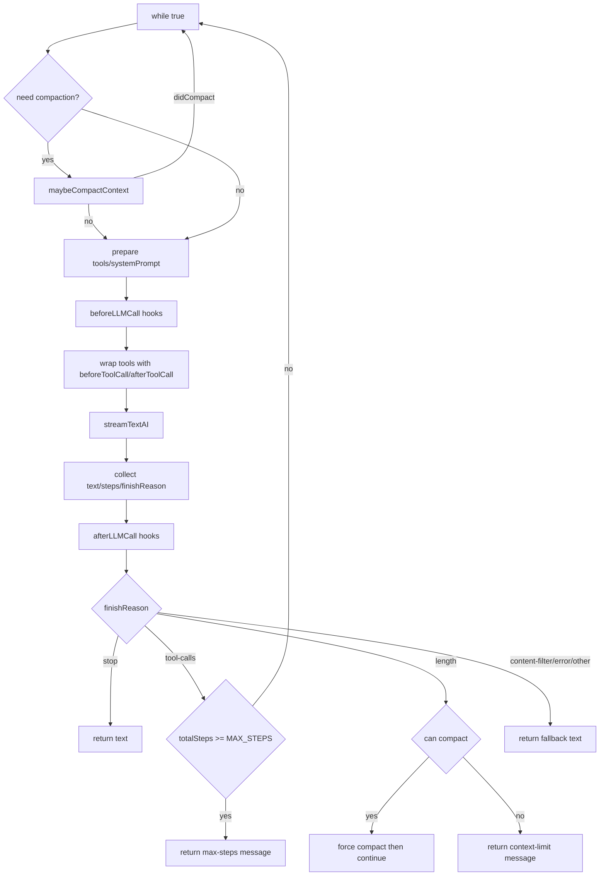

# 03｜Agent Loop 内核

## 1. loop 的职责边界

`core/loop.ts` 负责：
- 管理多轮推理/工具调用循环
- 处理上下文压缩触发与重试
- 执行 LLM 前后 hook
- 包装工具调用 hook
- 根据 `finishReason` 决策是否继续
- 处理错误、退避重试、中断

它不负责：
- 插件加载（由 `PluginManager` 负责）
- 工具注册（由 `Engine`/插件负责）

## 2. 主循环状态变量

运行时维护三个关键计数器：
- `errorCount`：错误累计，达到 `MAX_ERROR_COUNT` 终止
- `totalSteps`：累计 step 数，达到 `MAX_STEPS` 终止
- `compactionAttempts`：压缩次数，达到 `MAX_COMPACTION_ATTEMPTS` 停止压缩

## 3. 执行流程图

## 4. Hook 注入点与顺序

### 4.1 LLM 级 hook

- `beforeLLMCall`：每轮调用前执行，可变更 `tools` / `systemPrompt`
- `afterLLMCall`：每轮调用后执行，只读回调

执行顺序：数组顺序串行执行，后一个能看到前一个的变更。

### 4.2 Tool 级 hook

`wrapToolsWithHooks` 对每个工具做包装：
1. 顺序执行所有 `beforeToolCall`
2. 执行真实 `tool.execute`
3. 顺序执行所有 `afterToolCall`

这实现了统一切面能力（审计、鉴权、数据脱敏等）。

## 5. 流式输出与事件回调

loop 调用 `streamTextAI`，并在 `onChunk` 中分发：
- `text-delta` → `onText`
- `tool-call` → `onToolCall`
- `tool-result` → `onToolResult`

此外还支持：
- `onStepFinish`
- `onResponse`
- `onCompacted`

这让 CLI/上层 UI 可实现实时反馈与可观测事件流。

## 6. finishReason 分支语义

| finishReason | 行为 |
|---|---|
| `stop` | 正常完成，返回文本 |
| `tool-calls` | 若未超步数则继续循环 |
| `length` | 尝试强制压缩，失败后返回上下文受限提示 |
| `content-filter` | 返回过滤提示 |
| `error` | 返回失败提示 |
| 其他 | 返回默认完成文本 |

## 7. 错误恢复与退避

捕获异常后：
1. 若 `AbortError` 或 `abortSignal.aborted`：返回 `Request aborted.`
2. 错误计数 +1，若达到上限：失败退出
3. 若错误可重试（429/500/502/503）：指数退避（2s 起步，上限 30s）后重试
4. 其他错误直接返回

## 8. 关键实现亮点

- 将 compaction 放在循环入口和 `length` 分支，形成“常规 + 强制”双触发。
- tool hook 与 llm hook 分层明确，扩展边界清晰。
- 以 `finishReason` 驱动状态推进，语义清楚。

## 9. 已知风险与优化点

- `while(true)` 设计依赖多重 return/continue，后续可重构为显式状态机提升可读性。
- hook 为串行执行，若 hook 数量增多会影响时延。
- 当前 retry 仅按 status code 判断，可进一步引入错误分类体系。
- `totalSteps` 上限是全局累计，未区分“单轮异常高步数”与“跨轮正常累积”。

## 10. 推荐演进方向

1. 引入 `LoopTrace` 结构化日志：每轮记录输入摘要、hook耗时、finishReason。
2. 将 `isRetryableError` 扩展为策略接口（可按 provider 差异化）。
3. 为 hook 增加超时与失败隔离，防止插件 hook 拖垮主循环。
4. 引入 `maxWallClockMs`（总执行时长上限）保证服务质量。

---

本章结论：当前 loop 已具备生产级核心能力（重试、压缩、流式、hook 切面），下一阶段重点是“可观测 + 状态机化 + 策略化”。