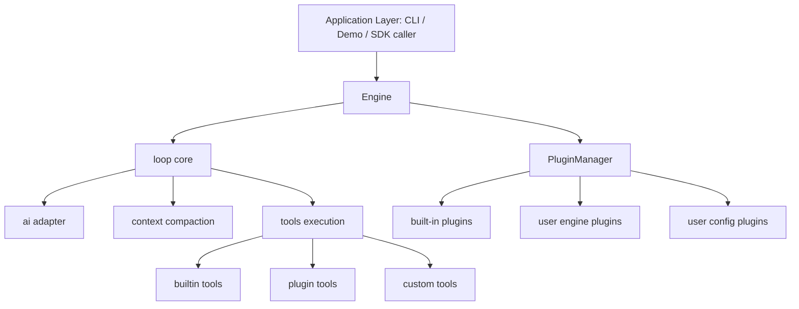

# 01 | Engine Overview and Design Goals

## 1. Goals and Positioning

`pulse-coder-engine` is an extensible Agent Runtime responsible for:
- Managing the AI conversation loop in a unified way
- Hosting tools (built-in + plugin + custom business tools)
- Providing plugin lifecycle and hook extension points
- Handling context compaction, retry, and runtime recovery strategies
- Exposing a stable API (`Engine`) for CLI or app-layer integrations

In the current implementation, the core design is:
- `Engine` handles orchestration and assembly
- `loop` handles execution and state progression
- `PluginManager` handles extension integration

## 2. Module Layers

## 3. Directory-to-Capability Mapping

| Directory | Role | Representative File |
|---|---|---|
| `Engine.ts` | Engine entry and orchestration | `Engine.ts` |
| `core/` | Runtime loop | `core/loop.ts` |
| `ai/` | LLM call adaptation | `ai/index.ts` |
| `context/` | Context compaction | `context/index.ts` |
| `tools/` | Tool registry and implementation | `tools/index.ts` + tool files |
| `plugin/` | Plugin contracts and manager | `EnginePlugin.ts` / `PluginManager.ts` |
| `built-in/` | Built-in plugin capability packs | `mcp/skills/plan-mode/sub-agent` |
| `config/` | Global constants and env vars | `config/index.ts` |
| `prompt/` | System prompt assembly | `prompt/system.ts` |

## 4. Core Abstractions

### 4.1 EngineOptions (caller-facing)

`EngineOptions` supports:
- `enginePlugins` / `userConfigPlugins`
- `disableBuiltInPlugins`
- `llmProvider` + `model`
- `tools` (direct business injection)
- `systemPrompt`
- `hooks` (legacy ToolHooks, converted internally)
- `logger`

This allows callers to scale from zero-code usage to deep customization.

### 4.2 Tool (unified protocol)

Unified structure:
- `name`
- `description`
- `inputSchema` (zod/flexible schema)
- `execute(input, context?)`

All tools are invoked through the same loop protocol and can be wrapped by hooks.

### 4.3 Plugin and Hook (extension protocol)

Plugins follow `EnginePlugin` lifecycle:
- `beforeInitialize`
- `initialize`
- `afterInitialize`
- `destroy`

Hooks are defined in `EngineHookMap`:
- `beforeRun` / `afterRun`
- `beforeLLMCall` / `afterLLMCall`
- `beforeToolCall` / `afterToolCall`

## 5. Global Execution View

## 6. Current Architecture Strengths

- Clear mainline: `Engine` + `loop` + `PluginManager` have distinct responsibilities.
- Low extension cost: tools/services/hooks can be injected via plugins.
- Good compatibility: legacy `ToolHooks` is still supported.
- Built-ins cover common capabilities: MCP, skills, plan-mode, sub-agent.

## 7. Current Boundaries and Known Constraints

- User config plugin “apply config” stage is still mostly placeholder.
- Multiple tools use sync I/O, which may block Node event loop.
- `SubAgentPlugin` calls `loop` directly; default provider/model inheritance is not explicit enough.
- Some plugins mix `console.*` and `context.logger`.

## 8. Suggested Next Iterations

- Expose runtime state (`step/error/compaction`) as structured metrics.
- Upgrade tool execution to async + timeout + cancellation abstraction.
- Add a policy layer (e.g., mode-based tool allowlist/blocklist).
- Add plugin health check and degradation strategy (plugin failure isolation).

---

Conclusion: The current implementation already has a production-evolvable skeleton. The next stage is turning extensibility into operability, observability, and governance.
