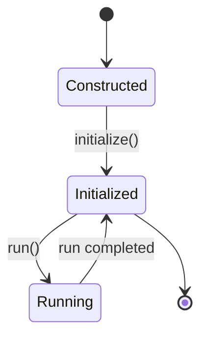
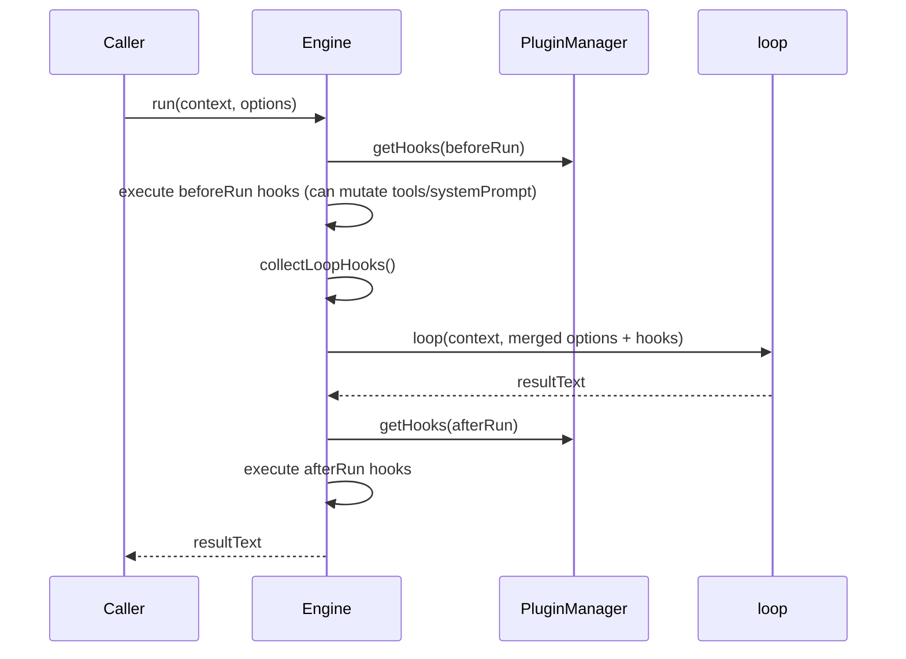

# 02 | Runtime Lifecycle (Engine)

## 1. Lifecycle Overview

`Engine` lifecycle has three phases:
1. Construction: initialize internal state and default tools
2. Initialization: load plugins and merge tools
3. Runtime: execute `run(context, options)` and return final text

## 2. Construction Phase (constructor)

Key actions:
- Create `PluginManager` (logger can be injected)
- Use `BuiltinToolsMap` as the initial tool set
- Save `options` and `config`

Notes:
- This phase **does not load plugins**.
- Global `config` inside Engine is map-like (`getConfig` / `setConfig`).

## 3. Initialization Phase (`initialize`)

### 3.1 `prepareEnginePlugins`

Priority logic:
- If `disableBuiltInPlugins = true`: only user plugins are used
- Else: `builtInPlugins + userPlugins`
- Default scan directories:
  - `.pulse-coder/engine-plugins`
  - `.coder/engine-plugins`
  - `~/.pulse-coder/engine-plugins`
  - `~/.coder/engine-plugins`

### 3.2 `PluginManager.initialize`

Order:
1. `loadEnginePlugins`
2. `validateCoreCapabilities`
3. `loadUserConfigPlugins`

### 3.3 Tool Merge

Final priority (high → low):
1. `EngineOptions.tools` (direct business injection)
2. Plugin-registered tools
3. Built-in tools `BuiltinToolsMap`

This guarantees that callers can override built-in tools by name.

## 4. Runtime Phase (`run`)

Full sequence:

### 4.1 `beforeRun`

- Source: plugin `beforeRun` hooks
- Behavior: can mutate `systemPrompt` and `tools`
- Use cases: tool pruning, prompt injection, pre-run policy checks

### 4.2 `collectLoopHooks`

Merges two hook sources:
- Plugin hooks (new system)
- `EngineOptions.hooks` (legacy)

Legacy conversion:
- `onBeforeToolCall(name, input)` → `beforeToolCall({name,input})`
- `onAfterToolCall(name, input, output)` → `afterToolCall({name,input,output})`

### 4.3 Loop Invocation Parameter Resolution

- `provider`: `run options` override `engine options`
- `model`: `run options` override `engine options`
- `systemPrompt`: value after `beforeRun` mutations
- `tools`: value after `beforeRun` mutations

### 4.4 `afterRun`

- Source: plugin `afterRun`
- Behavior: currently mostly read-only (no mutation return)
- Use cases: audit logging, metrics, session-final events

## 5. Engine Public Surface

| API | Description |
|---|---|
| `initialize()` | Start plugin system and build tool map |
| `run(context, options)` | Execute one full agent loop |
| `getPluginStatus()` | Snapshot of plugins/tools/hooks/services |
| `getTools()` | Snapshot of current tools |
| `getService(name)` | Fetch service registered by plugins |
| `getMode()` / `setMode()` | Plan Mode convenience APIs (via service) |
| `getConfig/setConfig` | Engine-local config key/value access |

## 6. Design Trade-offs in Lifecycle

### 6.1 Centralized init vs lazy loading

Current approach is centralized init.
Pros:
- Better runtime determinism
- Earlier error discovery

Cost:
- Higher startup latency
- Init time grows with plugin count

### 6.2 Tool merge timing

Current design merges plugin tools after initialization, then overlays caller tools.
Pros:
- Simple and stable
- Predictable precedence

Caveat:
- Runtime hot add/remove of tools would require new hot-reload mechanics.

## 7. Known Risk Points

- If caller forgets `initialize()`, `run()` still works but misses plugin tools/hooks (add guard in future).
- In multi-instance scenarios, plugin side effects (e.g., external connections) need isolation.
- `getConfig/setConfig` is weakly typed map, schema can be introduced later.

## 8. Suggested Enhancements

1. Add `EngineState` (`constructed/initialized/running`) and enforce checks before `run`.
2. Add `shutdown()` to call plugin `destroy` uniformly.
3. Output initialization report (load latency, failed plugins, skip reasons).
4. Add idempotency and concurrency guard for `initialize()`.

---

Conclusion: `Engine` already has a clear lifecycle skeleton. Next step is evolving it toward a stricter state machine and operations-grade initialization reporting.
