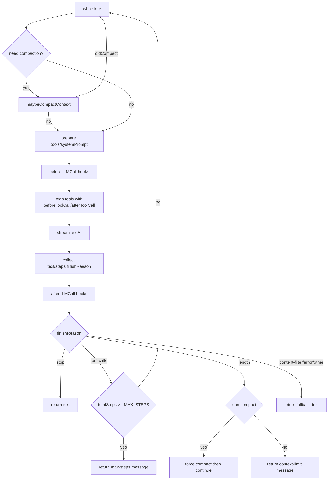

# 03 | Agent Loop Core

## 1. Responsibility Boundary of `loop`

`core/loop.ts` is responsible for:
- Managing multi-turn reasoning/tool-call loop
- Handling context compaction trigger and retries
- Executing LLM pre/post hooks
- Wrapping tool-call hooks
- Deciding continuation based on `finishReason`
- Handling error, backoff retry, and abort

It is not responsible for:
- Plugin loading (`PluginManager` owns this)
- Tool registration (`Engine`/plugins own this)

## 2. Main Runtime State Variables

The loop maintains three key counters:
- `errorCount`: terminate when reaching `MAX_ERROR_COUNT`
- `totalSteps`: terminate when reaching `MAX_STEPS`
- `compactionAttempts`: stop compacting when reaching `MAX_COMPACTION_ATTEMPTS`

## 3. Execution Flow

## 4. Hook Injection Points and Order

### 4.1 LLM-level hooks

- `beforeLLMCall`: runs before each LLM call, can mutate `tools` / `systemPrompt`
- `afterLLMCall`: runs after each LLM call, read-oriented callback

Execution order: sequential in array order; each hook sees previous mutations.

### 4.2 Tool-level hooks

`wrapToolsWithHooks` wraps each tool as:
1. Execute all `beforeToolCall` hooks in order
2. Execute real `tool.execute`
3. Execute all `afterToolCall` hooks in order

This provides a unified cross-cutting layer (audit, authz, masking, etc.).

## 5. Streaming Output and Event Callbacks

The loop calls `streamTextAI`, and dispatches via `onChunk`:
- `text-delta` → `onText`
- `tool-call` → `onToolCall`
- `tool-result` → `onToolResult`

Also supports:
- `onStepFinish`
- `onResponse`
- `onCompacted`

This allows CLI/UI layers to implement real-time feedback and event observability.

## 6. `finishReason` Branch Semantics

| finishReason | Behavior |
|---|---|
| `stop` | Normal finish, return text |
| `tool-calls` | Continue loop unless step limit reached |
| `length` | Force compaction; if still not possible, return context-limit message |
| `content-filter` | Return filtered-content message |
| `error` | Return failure message |
| others | Return generic completion text |

## 7. Error Recovery and Backoff

When exception is caught:
1. If `AbortError` or `abortSignal.aborted`: return `Request aborted.`
2. Increase error count; if at limit, fail fast
3. If retryable (429/500/502/503): exponential backoff (start 2s, cap 30s), then retry
4. Otherwise return directly

## 8. Implementation Highlights

- Compaction is attempted both at loop entry and `length` branch (“normal + forced” dual trigger).
- Clear separation between tool hooks and LLM hooks.
- State progression is driven by `finishReason`, with clean semantics.

## 9. Known Risks and Optimization Points

- `while(true)` relies on multiple `return/continue`; can be refactored into explicit state machine for readability.
- Hooks execute serially; many hooks can increase latency.
- Retry logic currently uses status code checks only; richer error taxonomy is possible.
- `totalSteps` is global cumulative count; does not distinguish bursty per-round spikes from normal accumulation.

## 10. Recommended Evolution

1. Add `LoopTrace` structured logging: per-round input summary, hook latency, finishReason.
2. Expand `isRetryableError` into policy interface (provider-specific behavior).
3. Add timeout and fault isolation to hooks.
4. Add `maxWallClockMs` cap for end-to-end runtime bound.

---

Conclusion: The loop already has production-grade fundamentals (retry, compaction, streaming, hook weaving). Next focus should be observability, state-machine refactor, and policy abstraction.
