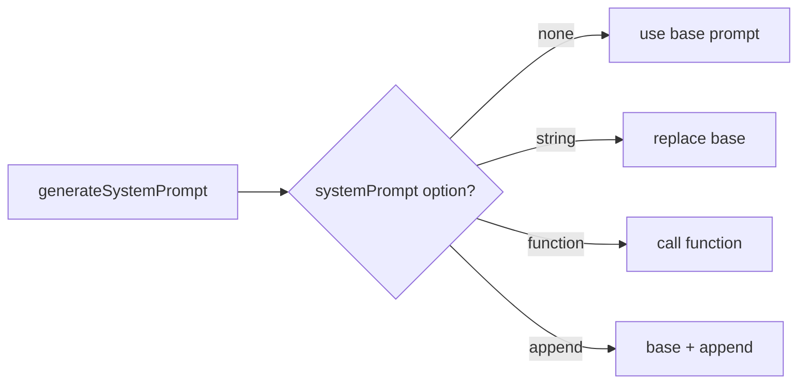

# 04 | LLM Adapter Layer and Prompt System

## 1. Design Goals

`ai/index.ts` and `prompt/system.ts` together provide:
- Unified LLM invocation entry points (streaming / non-streaming)
- Isolation from provider implementation differences
- Unified system prompt generation and override rules
- Summary call capability for context compaction

## 2. Provider Abstraction

Core abstraction: `LLMProviderFactory`
- Signature: `(model: string) => LanguageModel`
- Benefit: callers pass provider factory only, without coupling to specific SDK instances

Default provider from `config/index.ts`:
- If `USE_ANTHROPIC=true`, use Anthropic
- Otherwise use OpenAI-compatible provider

Default model:
- `ANTHROPIC_MODEL || OPENAI_MODEL || 'novita/deepseek/deepseek_v3'`

## 3. Prompt Assembly Strategy

`SystemPromptOption` supports three forms:
- `string`: fully replace default prompt
- `() => string`: generate dynamically per request
- `{ append: string }`: append to default prompt

`resolveSystemPrompt` does:
1. Start with default prompt from `generateSystemPrompt()`
2. Apply override/dynamic/append based on option type

## 4. Default System Prompt Source

`prompt/system.ts` strategy:
- If `agents.md` exists in current directory (case-insensitive) and is non-empty, use it
- Otherwise use built-in `DEFAULT_PROMPT`

This provides a zero-code project-level customization path.

## 5. Invocation Entrypoints

### 5.1 `streamTextAI`

- Used by main loop
- Supports `abortSignal`
- Supports chunk/step callbacks
- Supports injecting `ToolExecutionContext` to tool execution

### 5.2 `generateTextAI`

- Non-streaming call
- Kept as general text generation utility

### 5.3 `summarizeMessages`

- Dedicated to context compaction
- Uses a standalone summarization prompt (structured Chinese template in current impl)
- Controls `maxOutputTokens` (default `COMPACT_SUMMARY_MAX_TOKENS`)

## 6. `ToolExecutionContext` Injection

`wrapToolsWithContext` injects `context` into each tool:
- Typical use: `clarify` tool asks user for clarification
- Can carry future trace id / permission context
- Can carry runtime metadata via `runContext` (for example: platformKey, sessionId, memoryKey, userText, source)

## 7. `providerOptions`

Currently injected defaults:
- `openai.store = false`
- `openai.reasoningEffort = OPENAI_REASONING_EFFORT`

Notes:
- This gives consistent cross-call behavior.
- Can evolve into provider-specific policy modules.

## 8. Current Strengths

- Clean provider abstraction with low swap cost.
- Prompt strategy supports default + replace + append + dynamic.
- Clear separation of streaming and non-streaming entry points.
- Summary call for compaction is decoupled from main generation call.

## 9. Known Constraints

- `generateSystemPrompt()` reads file each call (can add cache + file watch).
- `providerOptions` is currently OpenAI-oriented; can be generalized.
- `summarizeMessages` shares provider/model with main loop, potentially high cost; separate compaction model can be added.

## 10. Suggested Evolution

1. Add prompt version and source metadata for debugging.
2. Introduce Prompt Pipeline (base -> plugin append -> runtime append).
3. Support task-based model routing (e.g., lightweight model for summary).
4. Collect token usage and feed into loop trace.

---

Conclusion: The LLM adapter is already extensible. Next priorities are performance caching, observability, and multi-model routing policy.
