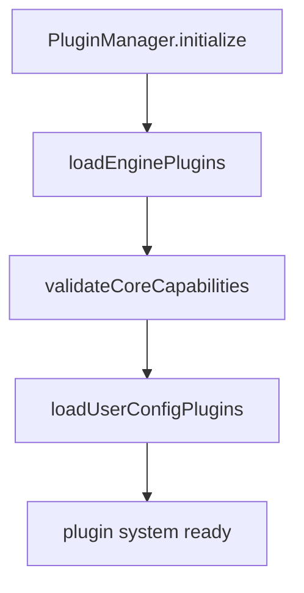

# 07 | Plugin System (Dual Track)

## 1. Design Goals

The plugin system is designed to support two extension modes:
- **Engine Plugin (code-based)**: TS/JS plugins can inject tools, hooks, services
- **User Config Plugin (declarative)**: end users can extend capabilities via JSON/YAML

Both are orchestrated by `PluginManager`.

## 2. Dual-Track Loading Order

Why this order matters:
- Ensure code-level capabilities are ready first
- Then apply user configs that may depend on them

## 3. Engine Plugin Contract

`EnginePlugin` required fields:
- `name`
- `version`
- `initialize(context)`

Optional:
- `dependencies`
- `beforeInitialize`
- `afterInitialize`
- `destroy`

`EnginePluginContext` provides:
- tool register/query
- hook register
- service register/query
- config read/write
- event emitter
- logger

## 4. Hook System (`EngineHookMap`)

| Hook | Timing | Data mutability |
|---|---|---|
| `beforeRun` | At `Engine.run` entry | Can mutate `tools/systemPrompt` |
| `afterRun` | After `Engine.run` | Read-only |
| `beforeLLMCall` | Before each LLM call | Can mutate `tools/systemPrompt` |
| `afterLLMCall` | After each LLM call | Read-only |
| `beforeToolCall` | Before each tool call | Can mutate `input` / throw to block |
| `afterToolCall` | After each tool call | Can mutate `output` |

## 5. Key `PluginManager` Mechanisms

### 5.1 Plugin Sources

- Directly from API via `options.plugins`
- Directory scan `**/*.plugin.{js,ts}`

Default scan directories:
- `.pulse-coder/engine-plugins`
- `.coder/engine-plugins`
- `~/.pulse-coder/engine-plugins`
- `~/.coder/engine-plugins`

### 5.2 Dependency Ordering

`sortPluginsByDependencies` uses DFS topological logic:
- Detect cyclic dependencies
- Initialize in dependency order

### 5.3 Initialization Context Injection

Each plugin gets a unified context and can:
- `registerTool(s)`
- `registerHook`
- `registerService`

This makes plugins first-class extension units.

## 6. User Config Plugin Contract

Declarative structure supports:
- `tools`
- `mcp.servers`
- `prompts`
- `subAgents`
- `skills`
- `env`
- `conditions`

Config file sources:
- `config.{json,yaml,yml}`
- `*.config.{json,yaml,yml}`

Also supports env substitution:
- `${VAR}` / `${VAR:-default}`

## 7. Current Implementation Status

`applyUserConfig` is currently scaffold-oriented:
- scanning/parsing/variable substitution are implemented
- but applying config into real tools/connections is not fully implemented yet

This is an explicit evolution point, not a bug.

## 8. Plugin System Status Snapshot

`getStatus()` can output:
- loaded engine plugin names
- loaded user config plugin names
- registered tools
- hook counts
- registered services

Useful for diagnostics and startup reports.

## 9. Risk Points

- Directory scanning + dynamic import requires suitable runtime/module conditions.
- Plugin hook failures can impact main flow (future isolation policy recommended).
- Config plugin types exist, but apply stage lacks strong execution validation.

## 10. Suggested Evolution

1. Add real executors to `applyUserConfig` (tool factory / MCP connector / sub-agent loader).
2. Add plugin health probes: init duration, failure reason, degraded status.
3. Add hook error policy options: `fail-fast` / `warn-and-skip`.
4. Add plugin permission boundaries (what hooks/services a plugin can access).

---

Conclusion: Plugin system skeleton is mature and value-bearing; next priority is pushing declarative config from parsing stage into execution stage.
