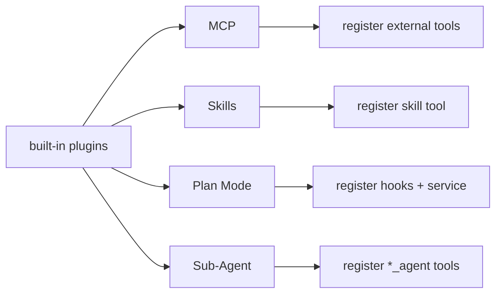
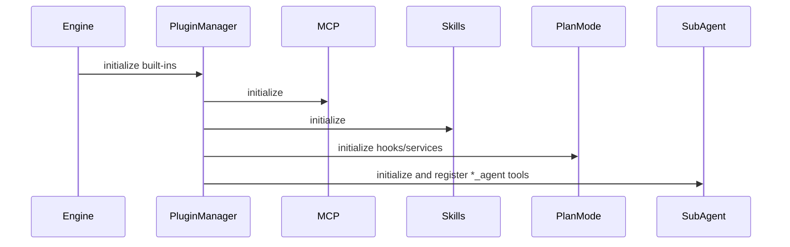

# 08 | Built-in Plugin Stack

## 1. Built-in Plugin Overview

`built-in/index.ts` currently loads four built-in plugins by default:
1. `builtInMCPPlugin`
2. `builtInSkillsPlugin`
3. `builtInPlanModePlugin`
4. `SubAgentPlugin`

Together they form the out-of-box capability layer.

## 2. MCP Plugin

### 2.1 Function

- Reads `.pulse-coder/mcp.json` (compatible with `.coder/mcp.json`)
- Supports `http`, `sse`, and `stdio` transports (`http` by default)
- Creates MCP client per configured server
- Fetches server tools and registers them into engine

### 2.2 Naming Convention

Registered tool name format: `mcp_${serverName}_${toolName}`

Benefits:
- Avoid name collisions across servers
- Easy prefix-based policy filtering

### 2.3 Service Registration

Each client is registered as `mcp:${serverName}` service for reuse by other plugins.

### 2.4 Current State

- Server failures are warned and skipped
- Uses `console.*` in several places; can be unified with `context.logger`

## 3. Skills Plugin

### 3.1 Scan Paths

Prefer new directory, remain compatible with legacy ones:
- project-level: `.pulse-coder/skills/**/SKILL.md`, `.coder/...`, `.claude/...`
- user-level: `~/.pulse-coder/skills/**/SKILL.md`, `~/.coder/...`

### 3.2 Parse Rules

- Uses `gray-matter` to parse frontmatter
- Requires `name` + `description`
- Markdown body is stored as skill content

### 3.3 Exposed Capability

Registers a single `skill` tool:
- input: `name`
- output: matched skill content object

Also registers `skillRegistry` service.

## 4. Plan Mode Plugin

### 4.1 Core Concepts

- Mode: `planning` / `executing`
- Intent: `PLAN_ONLY` / `EXECUTE_NOW` / `UNCLEAR`
- Tool categories: `read/search/write/execute/other`
- Events: mode enter, intent detect, mode switch, policy violation attempts

### 4.2 Injection Mechanism

Registers two key hooks:
- `beforeLLMCall`: inject policy prompt when in planning mode
- `beforeToolCall`: observe potentially violating calls in planning mode

### 4.3 Policy Characteristics

- Current behavior is **soft policy**: violation attempts are logged/emitted, not hard-blocked
- Prompt-level reinforcement guides model self-restraint

### 4.4 Service Exposure

Registers both `planMode` and `planModeService` aliases for external mode control.

## 5. Sub-Agent Plugin

### 5.1 Config Source

Scans:
- `.pulse-coder/agents`
- `.coder/agents`

Reads markdown frontmatter (`name`, `description`) and body (`systemPrompt`).

### 5.2 Tool Registration

Each agent config becomes `${name}_agent` tool.

Input:
- `task`
- `context` (optional)

Execution:
- Build sub-context
- Call `loop(...)` to run sub-task
- Tool set uses dynamic snapshot: `BuiltinToolsMap + context.getTools()`

### 5.3 Value

- Supports task delegation and role specialization
- Enables complex workflow decomposition via predefined roles

## 6. Plugin Collaboration

## 7. Known Improvement Points

- Plan Mode is currently prompt-level soft policy; hard governance needs blocking in `beforeToolCall`.
- Sub-agent provider/model inheritance should be made explicit.
- MCP and Skills logging style should be unified.

## 8. Suggested Evolution

1. Add configurable hard-block mode to Plan Mode (by tool category/risk level).
2. Let Sub-Agent inherit parent run provider/model/hook trace explicitly.
3. Add MCP server health checks and reconnect strategy.
4. Add Skills cache and hot reload to reduce repeated scan cost.

---

Conclusion: Built-in plugins already cover external integration, task orchestration, and behavior policy; they are a key differentiator of the engine.
