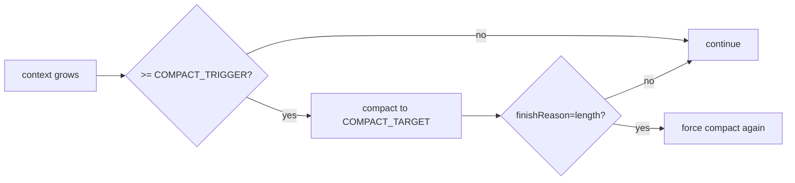

# 09 | Configuration, Operability, and Security Boundaries

## 1. Configuration Entry Overview

Current configuration comes from two main sources:
1. **Environment variables** (`.env` / runtime env)
2. **Code defaults** (`config/index.ts`)

There are also runtime option layers:
- `EngineOptions` (engine-level)
- `LoopOptions` (per-run level)

## 2. Configuration Inventory (by source)

### 2.1 Environment-driven

| Key | Purpose | Default / Notes |
|---|---|---|
| `USE_ANTHROPIC` | Use Anthropic provider | If unset, OpenAI-compatible path is used |
| `OPENAI_API_KEY` | OpenAI API key | Required when using OpenAI path |
| `OPENAI_API_URL` | OpenAI base URL | `https://api.openai.com/v1` |
| `ANTHROPIC_API_KEY` | Anthropic API key | Required when using Anthropic path |
| `ANTHROPIC_API_URL` | Anthropic base URL | `https://api.anthropic.com/v1` |
| `OPENAI_MODEL` | Default OpenAI model | Falls back with `ANTHROPIC_MODEL` chain |
| `ANTHROPIC_MODEL` | Default Anthropic model | Falls back with `OPENAI_MODEL` chain |
| `CONTEXT_WINDOW_TOKENS` | Context window estimate | `64000` |
| `COMPACT_TRIGGER` | Compaction trigger threshold | `75%` of window |
| `COMPACT_TARGET` | Compaction target threshold | `50%` of window |
| `KEEP_LAST_TURNS` | User turns kept during compaction | `6` |
| `COMPACT_SUMMARY_MAX_TOKENS` | Summary output token cap | `1200` |
| `MAX_COMPACTION_ATTEMPTS` | Max compaction attempts | `2` |
| `OPENAI_REASONING_EFFORT` | OpenAI reasoning parameter | optional |
| `CLARIFICATION_TIMEOUT` | Default clarify timeout | `300000ms` |
| `CLARIFICATION_ENABLED` | Clarification switch (currently exported only) | true unless explicit `false` |

### 2.2 Code constants (currently not env-driven)

| Constant | Current value | Notes |
|---|---|---|
| `MAX_TURNS` | `100` | Reserved constant, not directly used by loop now |
| `MAX_ERROR_COUNT` | `3` | Max loop error count |
| `MAX_STEPS` | `100` | Max loop steps |
| `MAX_TOOL_OUTPUT_LENGTH` | `30000` | Tool output truncation threshold |

## 3. Runtime Policy Parameter Interaction

## 4. Operability Focus

### 4.1 Observability (current)

Existing:
- plugin status snapshot `getPluginStatus()`
- hooks can host audit logic
- Plan Mode event stream (event emitter)

Recommended additions:
- per-round loop trace (latency, finishReason, tool count)
- compaction hit rate and ratio
- plugin load latency and error rate

### 4.2 Fault Recovery

Existing:
- retryable error exponential backoff
- max-error circuit breaker
- abort support

Recommended additions:
- provider-level fallback (primary model to backup model)
- tool-level retry policy by tool class

## 5. Security Boundaries

### 5.1 High-risk capabilities

- `bash`: arbitrary command execution
- `write/edit`: file mutation
- `mcp_*`: external system calls
- `*_agent`: indirect cascading execution

### 5.2 Current defenses

- input schema validation
- timeout caps (`bash`, `clarify`)
- output truncation
- Plan Mode soft policy prompts

### 5.3 Recommended defense upgrades

1. Path sandboxing (limit tool access scope)
2. Command policy (allowlist/denylist)
3. Explicit approval hook for high-risk actions
4. Structured audit logs (input/output summary/hash)

## 6. Deployment and Runtime Recommendations

### 6.1 Development

- Lower `MAX_STEPS` for faster fail cycles
- Enable verbose logger and inspect hook chain

### 6.2 Testing

- Pin model and parameters to reduce variance
- Use mock provider to cover loop branch regression

### 6.3 Production

- Manage keys and quotas by environment
- Monitor cost, latency, and error rate
- Reduce default privileges for high-risk tools

## 7. Suggested Test Matrix

- Config layer: missing/invalid env handling
- Loop layer: `stop/tool-calls/length/error` branches
- Compaction: trigger/no-trigger/summary-fail fallback
- Plugin layer: scan success, dependency order, cycle dependency
- Tool layer: timeout, error codes, truncation, clarification timeout

## 8. Suggested Operability Milestones

1. **M1**: structured telemetry (`trace + metrics`)
2. **M2**: policy center (tool permissions, risk levels, approvals)
3. **M3**: provider fallback and degraded run mode
4. **M4**: plugin health checks and auto-isolation

---

Conclusion: The current config system is sufficient for multi-environment usage, but production stability requires stronger observability, policy governance, and security auditing.
