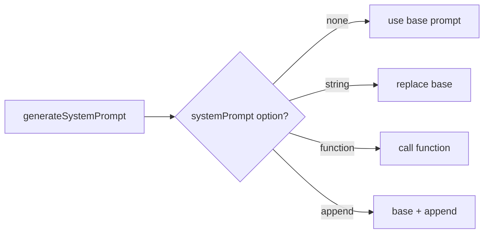

# 04｜LLM 适配层与 Prompt 系统

## 1. 设计目标

`ai/index.ts` 与 `prompt/system.ts` 共同承担：
- 提供统一 LLM 调用入口（流式/非流式）
- 隔离底层 provider 差异
- 统一 system prompt 生成与覆盖策略
- 提供上下文压缩用的摘要调用能力

## 2. Provider 抽象

核心抽象是 `LLMProviderFactory`：
- 签名：`(model: string) => LanguageModel`
- 好处：调用方只需传 provider factory，不耦合具体 SDK 实例

默认 provider 来自 `config/index.ts`：
- `USE_ANTHROPIC=true` 时使用 Anthropic
- 否则使用 OpenAI 兼容 provider

模型默认值：
- `ANTHROPIC_MODEL || OPENAI_MODEL || 'novita/deepseek/deepseek_v3'`

## 3. Prompt 组装策略

`SystemPromptOption` 支持三种形态：
- `string`：完全替换默认 prompt
- `() => string`：每次请求动态生成
- `{ append: string }`：在默认 prompt 后追加

对应实现 `resolveSystemPrompt`：
1. 先拿默认 prompt `generateSystemPrompt()`
2. 根据 option 类型执行覆盖/动态/追加

## 4. 默认 System Prompt 来源

`prompt/system.ts` 的策略：
- 若当前目录存在 `agents.md`（大小写不敏感）且内容非空：使用该文件内容
- 否则使用内置 `DEFAULT_PROMPT`

这给项目级定制留了“零代码”入口。

## 5. 调用入口

### 5.1 `streamTextAI`

- 用于主 loop
- 支持 `abortSignal`
- 支持 chunk/step 回调
- 支持把 `ToolExecutionContext` 注入到工具执行层

### 5.2 `generateTextAI`

- 非流式调用
- 当前主要作为通用调用能力保留

### 5.3 `summarizeMessages`

- 专用于 context compaction
- 使用单独总结 prompt（中文结构化模板）
- 控制 `maxOutputTokens`（默认 `COMPACT_SUMMARY_MAX_TOKENS`）

## 6. ToolExecutionContext 注入

`wrapToolsWithContext` 会将 `context` 注入每个工具：
- 典型用途：`clarify` 工具触发用户澄清
- 也可承载未来的 trace id、权限上下文
- 可通过 `runContext` 传入运行时元数据（例如 platformKey、sessionId、memoryKey、userText、source）

## 7. ProviderOptions

当前固定注入：
- `openai.store = false`
- `openai.reasoningEffort = OPENAI_REASONING_EFFORT`

说明：
- 这是跨调用默认参数，统一行为。
- 后续可以扩展为 provider-specific 策略模块。

## 8. 当前实现的优点

- provider 抽象干净，替换成本低。
- prompt 策略兼容“默认 + 覆盖 + 追加 + 动态工厂”。
- 流式与非流式入口分离清楚。
- 压缩总结调用与主调用解耦，便于后续独立优化。

## 9. 已知约束

- `generateSystemPrompt()` 每次调用都读取文件（可考虑缓存 + 文件变更监听）。
- providerOptions 当前对 OpenAI 更偏置，可做更通用配置层。
- `summarizeMessages` 与主模型共用 provider/model，可能导致成本偏高；后续可支持专门“压缩模型”。

## 10. 建议演进

1. 增加 Prompt 版本与来源标记（便于排障）。
2. 引入 Prompt Pipeline（base -> plugin append -> runtime append）。
3. 支持“不同任务类型对应不同 model route”（例如 summary 用轻模型）。
4. 增加 token usage 采集并回传到 loop trace。

---

本章结论：LLM 适配层已具备较好扩展性，下一阶段重点是“性能缓存 + 可观测 + 多模型路由策略”。