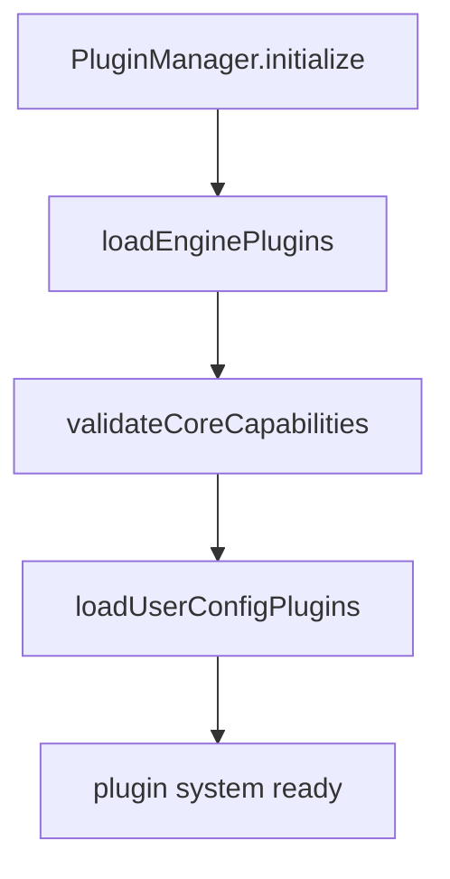

# 07｜插件系统（双轨）

## 1. 设计目标

插件系统希望同时满足两类扩展：
- **Engine Plugin（代码型）**：开发者编写 TS/JS 插件，注入工具、hook、service
- **User Config Plugin（声明型）**：终端用户通过 JSON/YAML 配置扩展能力

对应实现由 `PluginManager` 统一编排。

## 2. 双轨加载顺序

顺序意义：
- 先保证代码插件能力到位
- 再应用用户配置（依赖前者能力）

## 3. Engine Plugin 协议

`EnginePlugin` 必填：
- `name`
- `version`
- `initialize(context)`

可选：
- `dependencies`
- `beforeInitialize`
- `afterInitialize`
- `destroy`

`EnginePluginContext` 提供：
- 工具注册/查询
- hook 注册
- service 注册/查询
- config 读写
- event emitter
- logger

## 4. Hook 体系（EngineHookMap）

| Hook | 时机 | 是否可改数据 |
|---|---|---|
| `beforeRun` | `Engine.run` 入口 | 可改 `tools/systemPrompt` |
| `afterRun` | `Engine.run` 结束 | 只读 |
| `beforeLLMCall` | 每轮 LLM 前 | 可改 `tools/systemPrompt` |
| `afterLLMCall` | 每轮 LLM 后 | 只读 |
| `beforeToolCall` | 每次工具调用前 | 可改 `input` / 可抛错阻断 |
| `afterToolCall` | 每次工具调用后 | 可改 `output` |

## 5. PluginManager 关键机制

### 5.1 插件来源

- API 直接传入 `options.plugins`
- 目录扫描 `**/*.plugin.{js,ts}`

默认扫描目录：
- `.pulse-coder/engine-plugins`
- `.coder/engine-plugins`
- `~/.pulse-coder/engine-plugins`
- `~/.coder/engine-plugins`

### 5.2 依赖排序

`sortPluginsByDependencies` 采用 DFS 拓扑思路：
- 检测循环依赖
- 按依赖先后初始化

### 5.3 初始化上下文注入

每个插件初始化时拿到统一 context，可：
- `registerTool(s)`
- `registerHook`
- `registerService`

这让插件成为“一等扩展单元”。

## 6. User Config Plugin 协议

声明结构支持：
- `tools`
- `mcp.servers`
- `prompts`
- `subAgents`
- `skills`
- `env`
- `conditions`

配置文件来源：
- `config.{json,yaml,yml}`
- `*.config.{json,yaml,yml}`

并支持 `${VAR}` / `${VAR:-default}` 环境变量替换。

## 7. 当前实现状态说明

`applyUserConfig` 目前以日志和结构预留为主：
- 已能扫描/解析/替换变量
- 但“根据配置生成真实工具/连接”的执行逻辑还未完全落地

这属于明确可演进点，不是 bug。

## 8. 插件系统状态快照

`getStatus()` 可输出：
- 已加载 engine plugin 名称
- user config plugin 名称
- 已注册 tools
- 各 hook 数量
- 已注册 services

适合做诊断命令和启动报告。

## 9. 风险点

- 目录扫描 + 动态 import 对运行环境有要求（路径、模块格式、权限）。
- 插件 hook 运行失败会影响主流程（建议后续支持隔离策略）。
- 配置插件虽已有 schema 类型定义，但应用阶段尚未“强执行验证”。

## 10. 建议演进

1. 给 `applyUserConfig` 增加真实执行器（tool factory / mcp connector / sub-agent loader）。
2. 增加插件健康探针：初始化耗时、失败原因、降级状态。
3. 增加 hook error policy：`fail-fast` / `warn-and-skip` 可配置。
4. 增加插件权限边界（可注册哪些 hook、可访问哪些 service）。

---

本章结论：插件系统骨架成熟，核心价值已形成；下一阶段重点是把声明式配置从“解析层”推进到“执行层”。