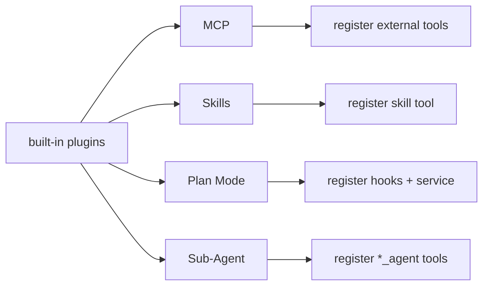
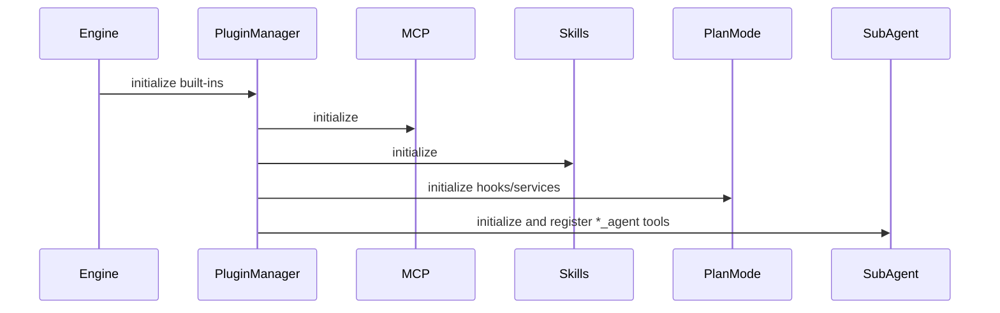

# 08｜内置插件体系

## 1. 内置插件总览

`built-in/index.ts` 当前默认加载四个内置插件：
1. `builtInMCPPlugin`
2. `builtInSkillsPlugin`
3. `builtInPlanModePlugin`
4. `SubAgentPlugin`

它们构成“开箱即用能力层”。

## 2. MCP 插件

### 2.1 功能

- 读取 `.pulse-coder/mcp.json`（兼容 `.coder/mcp.json`）
- 逐个服务器建立 MCP client
- 拉取 server tools 并注册到引擎

### 2.2 命名规范

注册工具名：`mcp_${serverName}_${toolName}`

优点：
- 防止多服务器同名工具冲突
- 便于后续按前缀筛选权限策略

### 2.3 服务注册

每个 client 以 `mcp:${serverName}` 注册为 service，供其他插件复用。

### 2.4 现状

- 对失败 server 采用 warn 并跳过
- 使用 `console.*` 较多，后续可统一到 `context.logger`

## 3. Skills 插件

### 3.1 扫描路径

优先新目录，兼容旧目录：
- 项目级：`.pulse-coder/skills/**/SKILL.md`、`.coder/...`、`.claude/...`
- 用户级：`~/.pulse-coder/skills/**/SKILL.md`、`~/.coder/...`

### 3.2 解析规则

- 使用 `gray-matter` 解析 frontmatter
- 要求 `name` + `description`
- markdown 正文作为 skill 内容

### 3.3 对外能力

注册一个 `skill` 工具：
- 输入 `name`
- 输出对应 skill 内容对象

并注册 `skillRegistry` service。

## 4. Plan Mode 插件

### 4.1 核心概念

- 模式：`planning` / `executing`
- 意图：`PLAN_ONLY` / `EXECUTE_NOW` / `UNCLEAR`
- 工具分类：`read/search/write/execute/other`
- 事件：模式进入、意图检测、模式切换、违规工具尝试

### 4.2 注入机制

插件注册两个关键 hook：
- `beforeLLMCall`：在 planning 模式下注入策略 prompt
- `beforeToolCall`：观察 planning 模式下的潜在违规调用

### 4.3 策略特点

- 当前是**软约束**：违规工具调用只记录事件和 warn，不强阻断
- 通过 prompt 增强模型自我约束

### 4.4 Service 暴露

注册 `planMode` 与 `planModeService`（双别名）用于外部读写模式。

## 5. Sub-Agent 插件

### 5.1 配置来源

扫描：
- `.pulse-coder/agents`
- `.coder/agents`

读取 markdown frontmatter（`name`、`description`）与正文（`systemPrompt`）。

### 5.2 工具注册

每个 agent 配置注册为 `${name}_agent` 工具。

输入：
- `task`
- `context`（可选）

执行：
- 构造子上下文
- 调用 `loop(...)` 执行子任务
- 工具集合为 `BuiltinToolsMap + context.getTools()` 的动态快照

### 5.3 价值

- 支持任务分发与能力专门化
- 让复杂任务可委派给预定义子角色

## 6. 插件协同关系

## 7. 已知改进点

- Plan Mode 目前是 prompt-level soft policy，若要强治理需在 beforeToolCall 中真正阻断。
- Sub-Agent 默认 loop provider/model 继承策略可显式化（当前偏默认配置）。
- MCP 与 Skills 插件日志风格需统一。

## 8. 建议演进

1. Plan Mode 支持可配置硬拦截（按工具分类/风险等级）。
2. Sub-Agent 支持继承父 run 的 provider/model/hook trace。
3. MCP 增加 server 健康检查与断线重连策略。
4. Skills 增加缓存与热重载（减少重复扫描成本）。

---

本章结论：内置插件已经覆盖“外部能力接入 + 任务编排 + 行为策略”，是引擎差异化能力的关键资产。