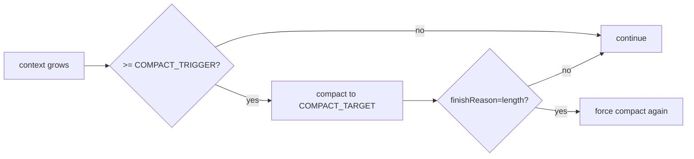

# 09｜配置、可运维与安全边界

## 1. 配置入口总览

当前配置来自两类来源：
1. **环境变量**（`.env` / 运行环境）
2. **代码常量默认值**（`config/index.ts`）

此外还有运行时选项：
- `EngineOptions`（引擎级）
- `LoopOptions`（单次运行级）

## 2. 配置项清单（按来源）

### 2.1 环境变量驱动

| 配置项 | 作用 | 默认值/说明 |
|---|---|---|
| `USE_ANTHROPIC` | 是否使用 Anthropic provider | 未设置时走 OpenAI 兼容 |
| `OPENAI_API_KEY` | OpenAI API key | 必要时提供 |
| `OPENAI_API_URL` | OpenAI base URL | `https://api.openai.com/v1` |
| `ANTHROPIC_API_KEY` | Anthropic API key | 必要时提供 |
| `ANTHROPIC_API_URL` | Anthropic base URL | `https://api.anthropic.com/v1` |
| `OPENAI_MODEL` | OpenAI 默认模型 | 与 `ANTHROPIC_MODEL` 二选一 |
| `ANTHROPIC_MODEL` | Anthropic 默认模型 | 与 `OPENAI_MODEL` 二选一 |
| `CONTEXT_WINDOW_TOKENS` | 上下文窗口估计值 | `64000` |
| `COMPACT_TRIGGER` | 压缩触发阈值 | 窗口 `75%` |
| `COMPACT_TARGET` | 压缩目标阈值 | 窗口 `50%` |
| `KEEP_LAST_TURNS` | 压缩保留最近 user turn 数 | `6` |
| `COMPACT_SUMMARY_MAX_TOKENS` | 摘要输出 token 上限 | `1200` |
| `MAX_COMPACTION_ATTEMPTS` | 最大压缩尝试次数 | `2` |
| `OPENAI_REASONING_EFFORT` | OpenAI 推理参数 | 可选 |
| `CLARIFICATION_TIMEOUT` | clarify 默认超时 | `300000ms` |
| `CLARIFICATION_ENABLED` | 澄清开关（当前仅导出） | 非 `false` 即 true |

### 2.2 代码常量（当前非 env）

| 常量 | 当前值 | 说明 |
|---|---|---|
| `MAX_TURNS` | `100` | 预留常量，当前 loop 未直接使用 |
| `MAX_ERROR_COUNT` | `3` | loop 最大错误次数 |
| `MAX_STEPS` | `100` | loop 最大 step 数 |
| `MAX_TOOL_OUTPUT_LENGTH` | `30000` | 工具输出截断阈值 |

## 3. 运行时策略参数关系

## 4. 可运维关注点

### 4.1 可观测性（当前能力）

已有：
- 插件状态快照 `getPluginStatus()`
- hook 回调可挂审计逻辑
- Plan Mode 事件流（event emitter）

建议补充：
- 每轮 loop trace（耗时、finishReason、tool调用数）
- compaction 命中率与压缩率
- plugin load 耗时与错误率

### 4.2 故障恢复

已有：
- 可重试错误指数退避
- 最大错误次数熔断
- abort 支持

建议补充：
- provider 级 fallback（主模型失败切备模型）
- 工具级重试策略（按工具类型区分）

## 5. 安全边界

### 5.1 高风险能力

- `bash`：任意命令执行
- `write/edit`：文件修改
- `mcp_*`：外部系统调用
- `*_agent`：间接级联执行

### 5.2 当前防线

- 输入 schema 校验
- timeout 上限（bash、clarify）
- 输出截断
- Plan Mode 的软策略提示

### 5.3 建议防线增强

1. 路径沙箱（限制工具访问范围）。
2. 命令策略（allowlist/denylist）。
3. 高风险动作显式审批 hook。
4. 审计日志结构化落盘（包含输入输出摘要/hash）。

## 6. 部署与运行建议

### 6.1 开发环境

- 适当降低 `MAX_STEPS`（方便快速失败）
- 开启详细 logger，关注 hook 链路

### 6.2 测试环境

- 固定模型与参数，降低波动
- 用 mock provider 覆盖 loop 分支回归

### 6.3 生产环境

- 分环境管理密钥与配额
- 做成本、时延、错误率监控
- 对高风险工具默认降权

## 7. 建议测试矩阵

- 配置层：env 缺失/非法值处理
- loop 层：`stop/tool-calls/length/error` 分支
- compaction：触发/不触发/摘要失败 fallback
- 插件层：扫描成功、依赖排序、循环依赖
- 工具层：超时、错误码、输出截断、澄清超时

## 8. 里程碑建议（运维化）

1. **M1**：结构化 telemetry（trace + metrics）。
2. **M2**：策略中心（工具权限、风险分级、审批）。
3. **M3**：provider fallback 与降级运行模式。
4. **M4**：插件健康检查与自动隔离。

---

本章结论：配置体系已具备多环境基础，但进入稳定生产仍需要补齐“可观测、策略治理、安全审计”三件套。