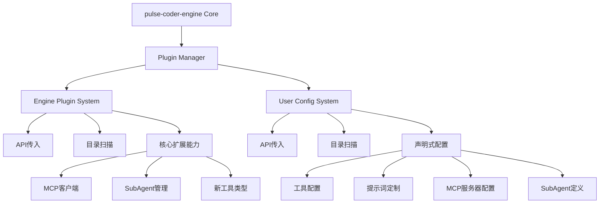

# 双轨插件系统技术架构详解

## 系统架构图



## 核心组件设计

### 1. 插件管理器 (PluginManager)

```typescript
class PluginManager {
  private enginePluginLoader: EnginePluginLoader;
  private userConfigLoader: UserConfigLoader;
  
  async initialize(options: PluginOptions) {
    // 1. 引擎插件优先加载
    await this.enginePluginLoader.load(options.enginePlugins);
    
    // 2. 验证核心能力
    await this.validateCoreCapabilities();
    
    // 3. 用户配置后加载
    await this.userConfigLoader.load(options.userConfigs);
  }
}
```

### 2. 引擎插件加载器

```typescript
class EnginePluginLoader {
  private plugins: Map<string, EnginePlugin> = new Map();
  
  async load(options: EnginePluginLoadOptions) {
    // API传入插件
    if (options.plugins) {
      for (const plugin of options.plugins) {
        await this.registerPlugin(plugin);
      }
    }
    
    // 目录扫描插件
    if (options.scan !== false) {
      const scanPaths = options.dirs || DEFAULT_ENGINE_PLUGIN_DIRS;
      for (const dir of scanPaths) {
        await this.scanDirectory(dir);
      }
    }
  }
  
  private async scanDirectory(dir: string) {
    const pattern = '**/*.plugin.{js,ts}';
    const files = await glob(pattern, { cwd: dir });
    
    for (const file of files) {
      const plugin = await this.loadPluginFile(path.join(dir, file));
      await this.registerPlugin(plugin);
    }
  }
}
```

### 3. 用户配置加载器

```typescript
class UserConfigLoader {
  private configs: UserConfig[] = [];
  
  async load(options: UserConfigLoadOptions) {
    // API传入配置
    if (options.configs) {
      this.configs.push(...options.configs);
    }
    
    // 目录扫描配置
    if (options.scan !== false) {
      const scanPaths = options.dirs || DEFAULT_USER_CONFIG_DIRS;
      for (const dir of scanPaths) {
        await this.scanConfigs(dir);
      }
    }
    
    // 验证和应用配置
    await this.applyConfigs();
  }
  
  private async scanConfigs(dir: string) {
    const patterns = ['config.{json,yaml,yml}', '*.config.{json,yaml,yml}'];
    
    for (const pattern of patterns) {
      const files = await glob(pattern, { cwd: dir });
      for (const file of files) {
        await this.loadConfigFile(path.join(dir, file));
      }
    }
  }
}
```

## 命名空间隔离机制

### 1. 插件注册表隔离

```typescript
class PluginRegistry {
  private engineRegistry = new Map<string, EnginePluginInstance>();
  private userRegistry = new Map<string, UserConfigInstance>();
  
  // 引擎插件注册 - 不可覆盖
  registerEnginePlugin(plugin: EnginePlugin): boolean {
    if (this.engineRegistry.has(plugin.name)) {
      throw new Error(`Engine plugin ${plugin.name} already exists`);
    }
    this.engineRegistry.set(plugin.name, plugin);
    return true;
  }
  
  // 用户配置注册 - 可更新
  registerUserConfig(config: UserConfig): void {
    this.userRegistry.set(config.name, config);
  }
}
```

### 2. 能力边界定义

```typescript
// 引擎插件能力
interface EngineCapabilities {
  registerToolType(type: string, factory: ToolFactory): void;
  extendContextProcessor(processor: ContextProcessor): void;
}

// 用户配置能力
interface UserCapabilities {
  configureTool(name: string, config: ToolConfig): void;
  configureMcpServer(server: MCPServerConfig): void;
  defineSubAgent(agent: SubAgentConfig): void;
}
```

## 错误隔离机制

### 1. 插件执行隔离

```typescript
class SafePluginExecutor {
  async executePlugin<T>(
    plugin: EnginePlugin,
    context: EngineContext,
    operation: () => Promise<T>
  ): Promise<T> {
    try {
      return await operation();
    } catch (error) {
      this.logger.error(`Plugin ${plugin.name} failed:`, error);
      
      // 引擎插件错误 - 中断启动
      if (plugin.type === 'engine') {
        throw new EnginePluginError(plugin.name, error);
      }
      
      // 用户配置错误 - 记录并继续
      this.recordUserError(plugin.name, error);
      return null as T;
    }
  }
}
```

### 2. 配置验证器

```typescript
class ConfigValidator {
  private schemas = new Map<string, z.ZodSchema>();
  
  constructor() {
    // 注册验证模式
    this.register('tool', toolConfigSchema);
    this.register('mcp', mcpConfigSchema);
    this.register('subAgent', subAgentConfigSchema);
  }
  
  validate(config: any, type: string): ValidationResult {
    const schema = this.schemas.get(type);
    if (!schema) {
      return { valid: false, errors: [`Unknown config type: ${type}`] };
    }
    
    try {
      schema.parse(config);
      return { valid: true };
    } catch (error) {
      return { 
        valid: false, 
        errors: error.errors.map(e => e.message) 
      };
    }
  }
}
```

## 插件文件结构规范

### 引擎插件规范
```
engine-plugins/
├── mcp-client/
│   ├── mcp-client.plugin.js
│   ├── package.json
│   └── README.md
├── sub-agent/
│   ├── sub-agent.plugin.ts
│   ├── tsconfig.json
│   └── dist/
└── custom-tool/
    ├── custom-tool.plugin.js
    └── types.d.ts
```

### 用户配置规范
```
user-config/
├── config.json          # 主配置
├── team-standards.yaml  # 团队标准
├── personal.json        # 个人偏好
└── mcp-servers/
    ├── filesystem.json
    └── github.yaml
```

## 性能优化策略

### 1. 插件缓存
```typescript
class PluginCache {
  private cache = new Map<string, CachedPlugin>();
  
  async loadWithCache(key: string, loader: () => Promise<any>) {
    const cached = this.cache.get(key);
    if (cached && !this.isStale(cached)) {
      return cached.data;
    }
    
    const data = await loader();
    this.cache.set(key, { data, timestamp: Date.now() });
    return data;
  }
}
```

### 2. 并行加载
```typescript
class ParallelLoader {
  async loadPluginsConcurrently(plugins: Plugin[]) {
    const chunks = this.createChunks(plugins, 5);
    
    for (const chunk of chunks) {
      await Promise.allSettled(
        chunk.map(plugin => this.loadPlugin(plugin))
      );
    }
  }
}
```

## 调试与监控

### 1. 插件调试接口

```typescript
interface PluginDebugger {
  listLoadedPlugins(): PluginInfo[];
  getPluginDetails(name: string): PluginDetails;
  enablePluginLogging(name: string): void;
  reloadPlugin(name: string): Promise<void>;
}

// 使用示例
const debugger = engine.getPluginDebugger();
debugger.listLoadedPlugins();
```

### 2. 性能监控

```typescript
class PluginMonitor {
  private metrics = new Map<string, PluginMetrics>();
  
  record(pluginName: string, metric: string, value: number) {
    const key = `${pluginName}.${metric}`;
    this.metrics.set(key, { value, timestamp: Date.now() });
  }
  
  getReport(): PluginReport {
    return {
      loadTimes: this.getLoadTimes(),
      memoryUsage: this.getMemoryUsage(),
      errorCounts: this.getErrorCounts()
    };
  }
}
```

## 安全机制

### 1. 插件签名验证
```typescript
class PluginSecurity {
  async verifySignature(pluginPath: string): Promise<boolean> {
    const signaturePath = `${pluginPath}.sig`;
    const publicKey = await this.getPublicKey();
    
    return this.crypto.verify(
      await fs.readFile(pluginPath),
      await fs.readFile(signaturePath),
      publicKey
    );
  }
}
```

### 2. 沙箱执行
```typescript
class PluginSandbox {
  async execute(plugin: EnginePlugin, context: EngineContext) {
    const sandbox = new VM({
      timeout: 5000,
      memoryLimit: '100MB',
      allowModules: ['crypto', 'fs']
    });
    
    return sandbox.run(plugin.code, context);
  }
}
```

## 版本兼容性

### 1. 语义化版本检查
```typescript
class VersionChecker {
  isCompatible(required: string, actual: string): boolean {
    return semver.satisfies(actual, required);
  }
  
  getMigrationPath(from: string, to: string): MigrationPath {
    return this.migrations.find(path => 
      path.from === from && path.to === to
    );
  }
}
```

## 部署策略

### 1. 环境隔离
```typescript
const ENV_CONFIGS = {
  development: {
    scanPaths: ['./dev-plugins', './dev-config'],
    hotReload: true,
    debugMode: true
  },
  production: {
    scanPaths: ['/opt/coder/plugins', '/etc/coder/config'],
    hotReload: false,
    debugMode: false
  }
};
```